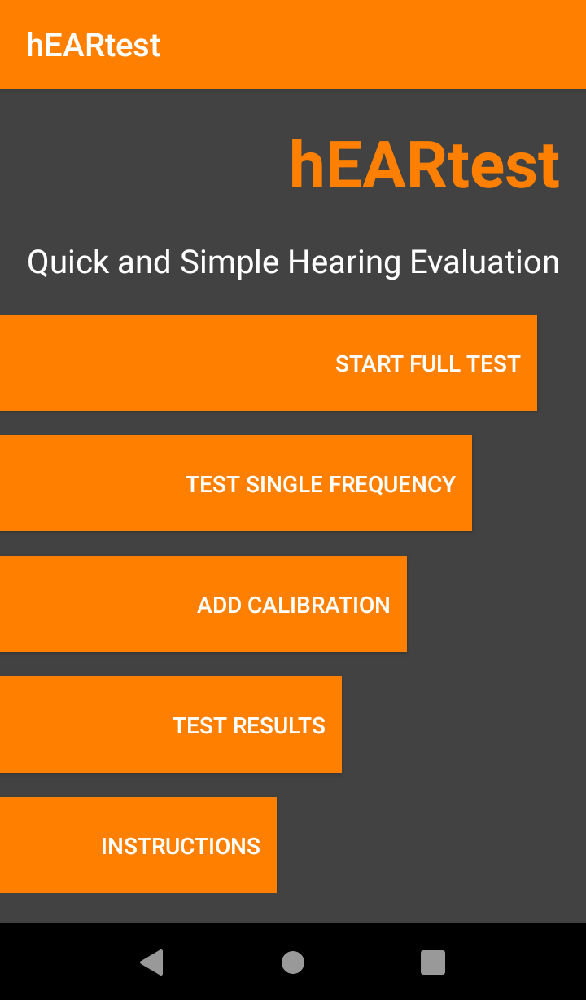
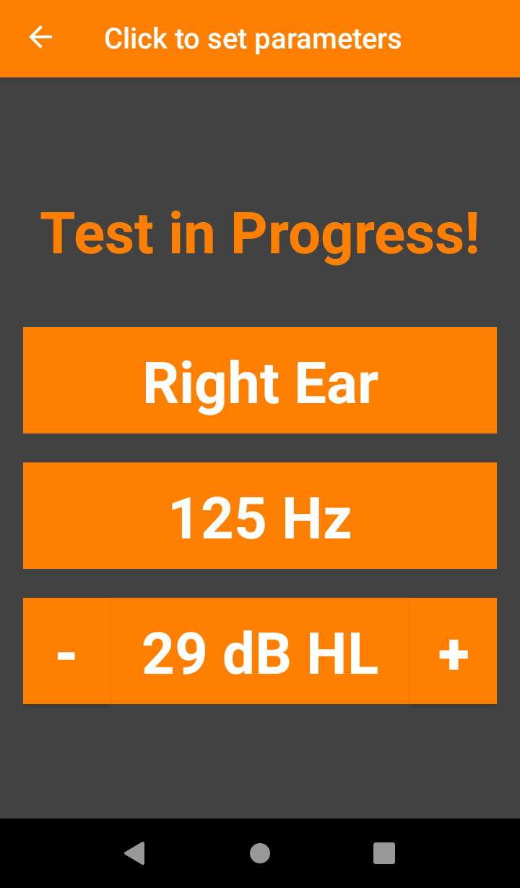
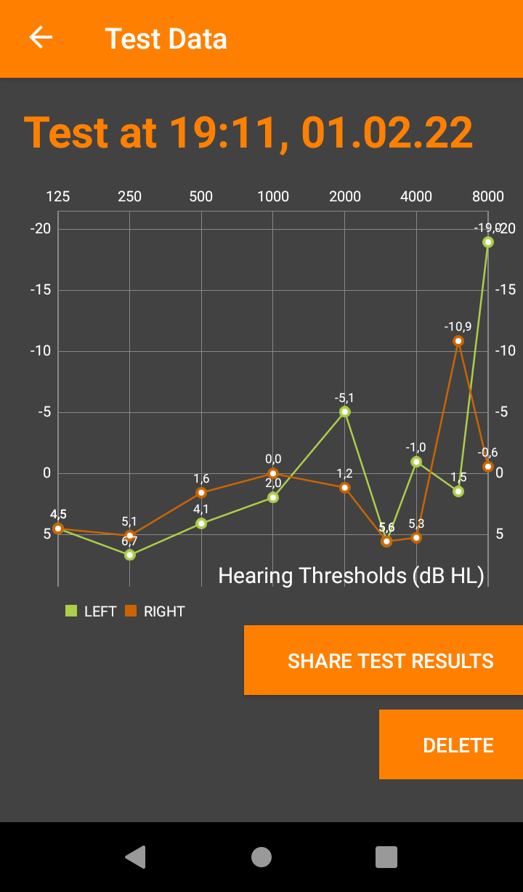
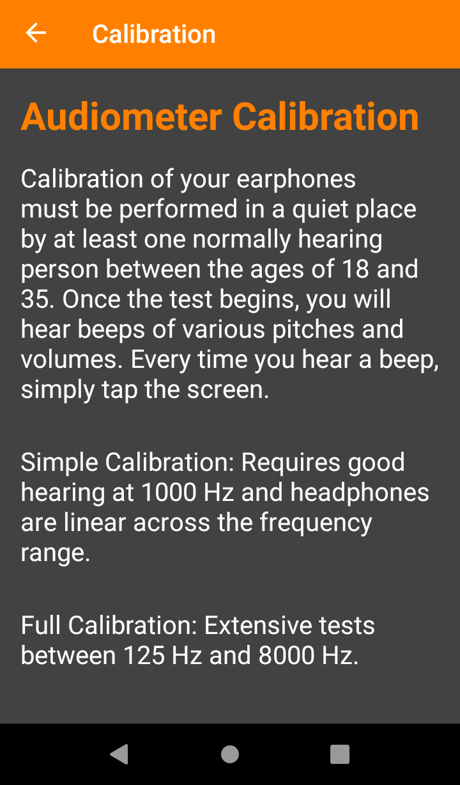
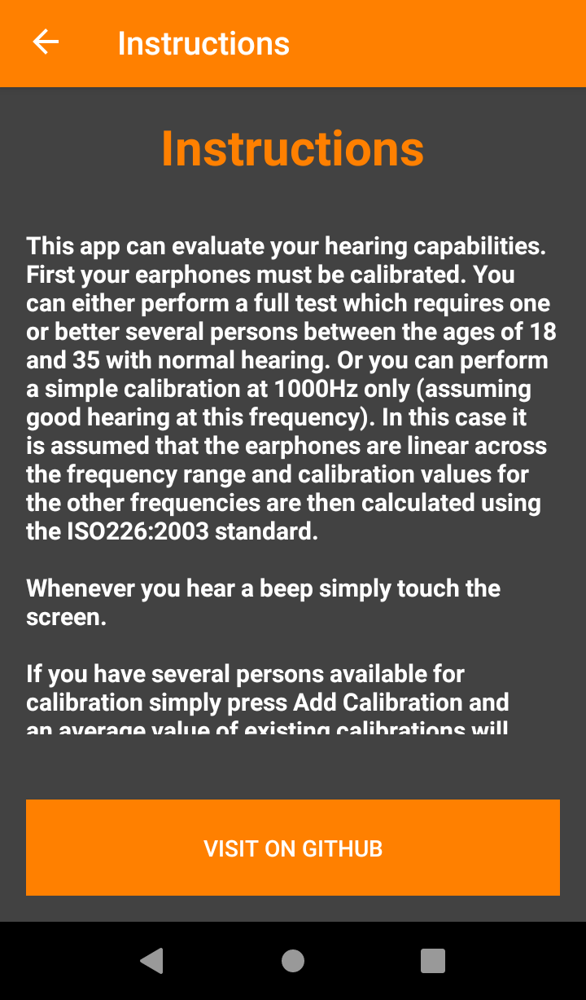

hEARtest
------------------------------------------------

    

Quick and Simple Hearing Evaluation

This app can evaluate your hearing capabilities. 
First your earphones must be calibrated. You can either perform a full test which requires one or better several persons
between the ages of 18 and 35 with normal hearing. Or you can perform a simple calibration at 1000Hz only (assuming good hearing at
this frequency). In this case it is assumed that the earphones are linear across the frequency range and calibration values for the 
other frequencies are then calculated using the ISO226:2003 standard.
Whenever you hear a beep simply touch the screen.
If you have several persons available for calibration simply press "Add Calibration" and an average value of existing calibrations
will be calculated. You may also delete the whole calibration.

After that you can perform tests and view them in test results.

You can then also perform tests at single frequencies.
There you can manually select ear, frequency, and sound amplitude by clicking on the buttons.

Backup/restore is also available.

This app is published under GNU GPL V3 License.

The original version of this code is published under MIT license, Copyright (c) 2014 Reece Stevens.

https://github.com/ReeceStevens/ut_ewh_audiometer_2014

